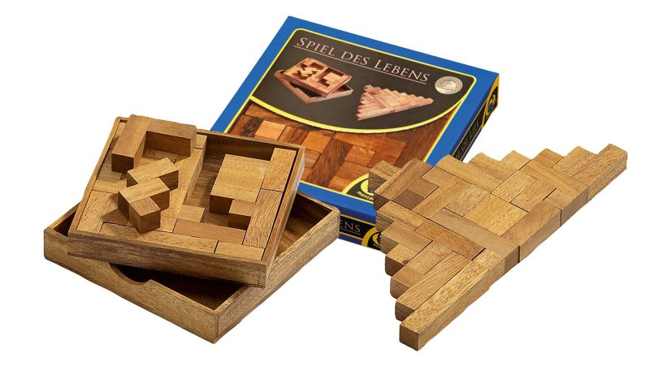

Back in 2018, I bought a puzzle set called "The Game of Life" from Philos on Amazon, just to get free shipping. Since then, I’ve occasionally taken it out to give it a try, but I never put in serious effort. I’ve never solved it, not even once, and I’ve never restored it to its original state.

Over the past few years, I’ve gradually transitioned from someone who handled complex logic at work to a nearly full-time chauffeur, accompanying my little boy to sports training. My time is running short, and many important aspects of my life have stagnated to an absurd degree (completely unrelated to COVID). This puzzle is far from being one of those important things, but I still wish to see it through, hence this program. Perhaps it's also a good exercise for an aging and deteriorating brain.
